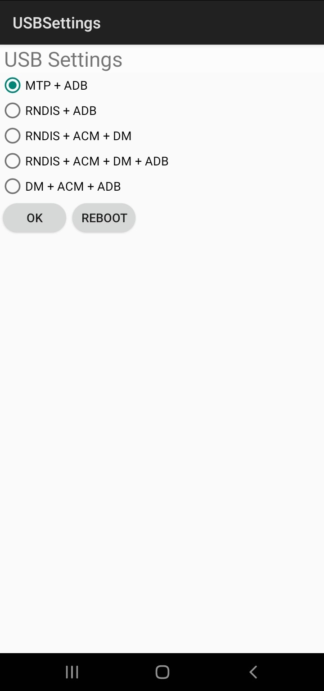
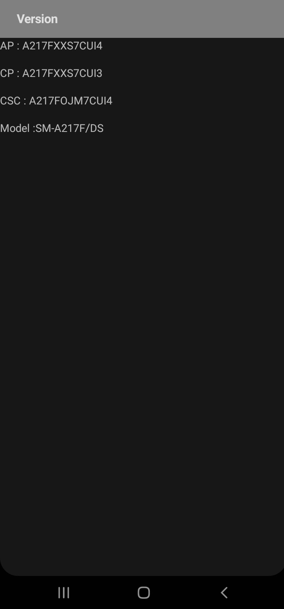
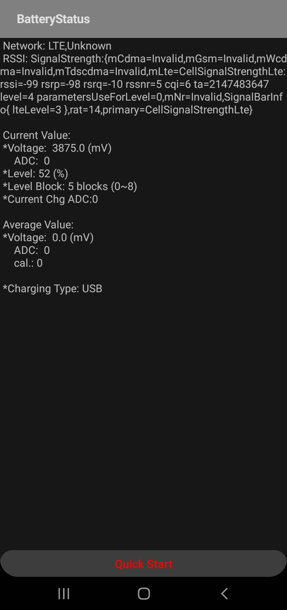
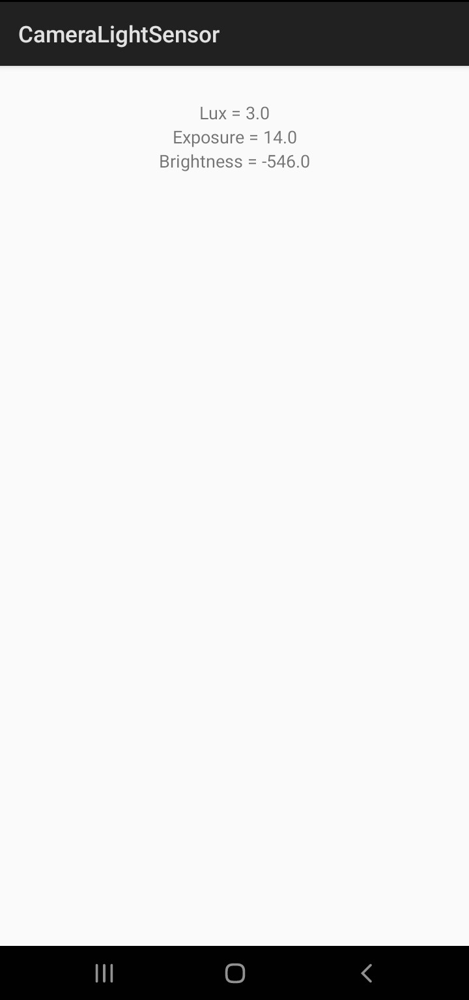
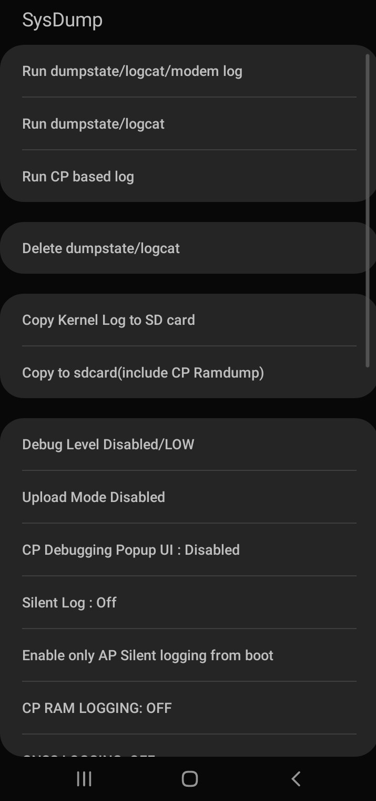
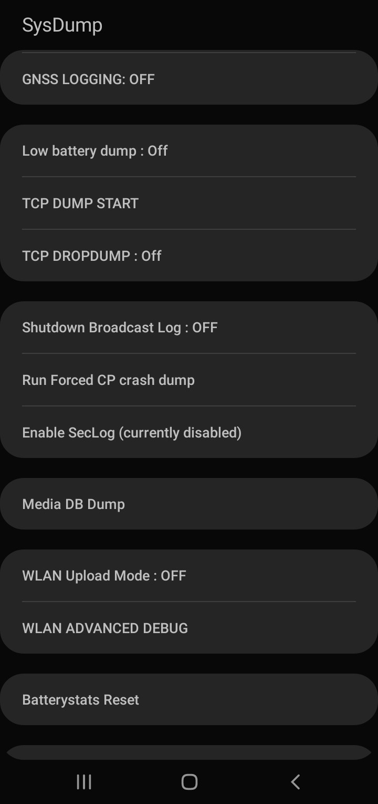
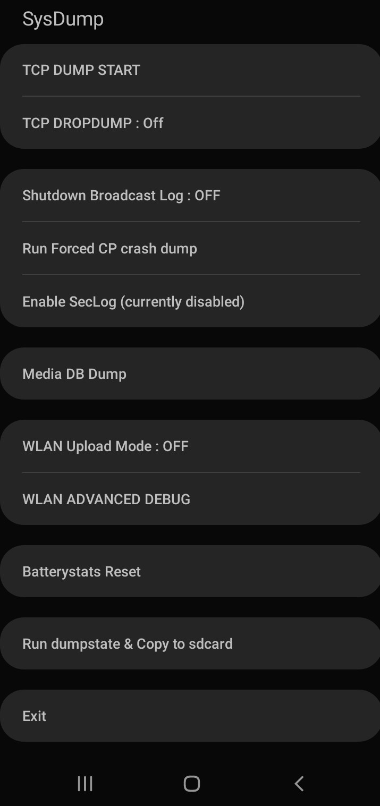

### Extract dialer codes from device
```bash
package_name_trim=$(pm list packages -s -f | awk -F 'package:' '{print $2}' | awk -F '=' '{print $2}')

for i in ${package_name_trim}; do
  echo "${i}" && pm dump "${i}" | grep -E 'Scheme: "android_secret_code"|Authority: "[0-9].*"|Authority: "[A-Z].*"' >> extracted_codes.txt
done
```
<table>
  <tr>
    <td align="center" width="20%">
      <br>
      <span><b>*#0808#</b></span> 
    </td>
    <td align="center" width="20%">
      <br>
      <span><b>*#1234#</b></span> 
    </td>
  </tr>
  <tr>
    <td align="center" width="20%">
      <br>
      <span><b>*#0228#</b></span> 
    </td>
    <td align="center" width="20%">
      <br>
      <span><b>*#8727#</b></span>
    </td>
  </tr>
  <tr>
    <td align="center" width="20%">
      <br>
      <span><b>*#7277#</b></span> 
    </td>
    <td align="center" width="20%">
      <br>
      <span><b>*#9900#</b></span>
    </td>
  </tr>
</table>
